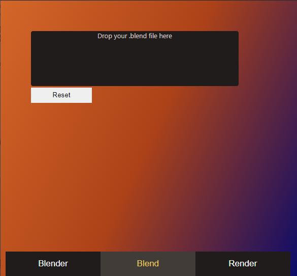

# CMD 4 RENDZ
A window app that renders out single images, image sequences and video output from .blend files made with Blender 3D program through it's command line.

Rendering through Blender's cli improves on time taken fractionally. This project was meant to automate parts of that process albeit using a GUI all the same.
## Steps
### Blender
On the very first page, drop your Blender application file. This will be used to trigger the cli from your preferred Blender version.

This only needs to be done once.

### Blend
On the second page, drop your .blend project file.

### Render
On the final page, click on Render! to start the job. File outputs will be stored in the .blend-specified path or C:\\. Customization will be added in future versions.

## Security Concerns
CMD 4 RENDZ leverages Electron's shell API to trigger cli jobs. Naturally, there's always the risk of injecting malicious scripts to gain access to OS native infrastructure. To combat this, CMD 4 RENDZ ships with multiple restrictions on where scripts can run and which shells to run.

## Known Issues
* Once the render job is initiated, Blender's cli runs silently which makes it difficult at the moment to stop without quiting the app altogether. A possible solution is to create a shell window for the render processes or assigning a specific PID.